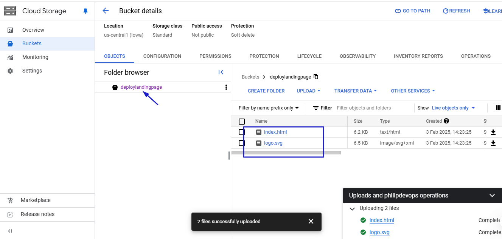
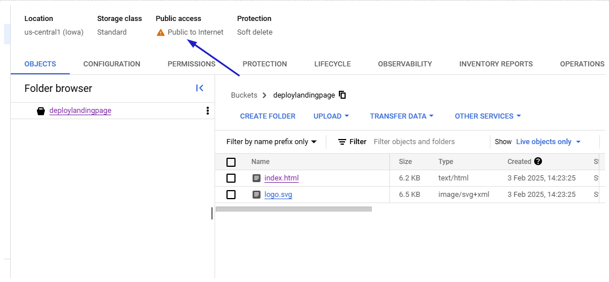
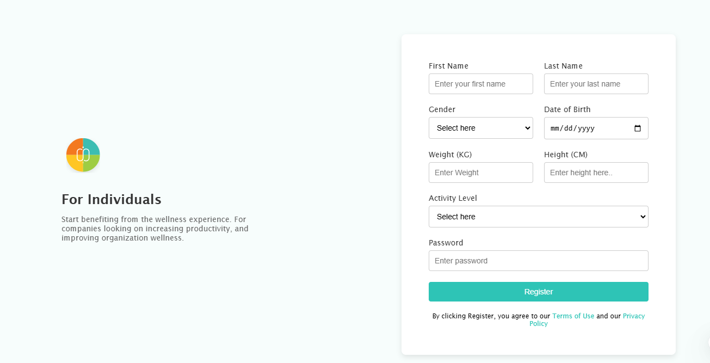

## **Module 1: Introduction to DevOps and Cloud Fundamentals**

- Overview of DevOps principles, cloud computing, and industry best practices.
- Hands-on Lab: Set up free-tier accounts on AWS/Azure/GCP.
- Project: Deploy a simple static website using an S3 bucket or cloud storage service.

### Steps taken to deploy a simple static website via the console using an Cloud Storage bucket.

- Log into the Google cloud console and create a project
- Click on the menu icon and navigate to Cloud storage
- Create the "Create Bucket" button to create a new bucket
- Input the required parameters to create your bucket
- Upload your website files into the bucket created
  

- Grant access to the public by updating the permissions settings of the bucket to make it publicly accessible

  - remove the prevent public access and add allUser with the role of storage object viewer
    

- Click on the index file to get the public url of the website accessible to users on browser as seen below.
  

- Clean up the console by deleting the bucket created.

### What did I learn?

- The fundamentals of cloud computing and devops
- How to create a bucket and upload files to deploy a static website
- How to enable and disable public access to my bucket
