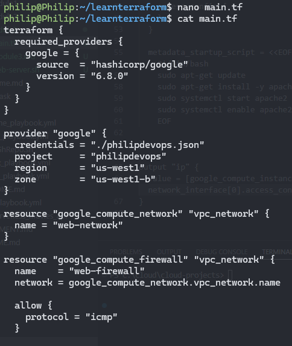
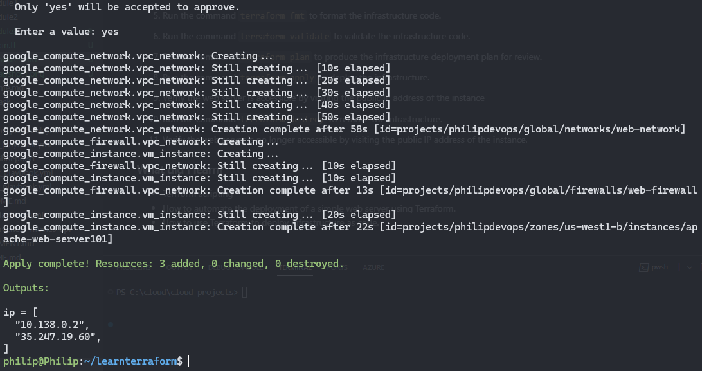
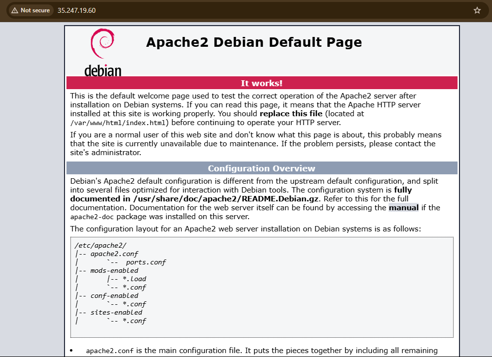

## **Module 3: Infrastructure as Code (IaC) Basics**

- Introduction to Terraform/CloudFormation and infrastructure automation.
- Hands-on Lab: Deploy an EC2 instance or Virtual Machine using IaC.
- Project: Automate the deployment of a simple web server using Terraform.

### Steps to automate the deployment of a simple web server using Terraform on GCP.

1. Install terraform on the local linux machine or a cloud VM.
2. Create a new directory for the project and navigate into it.
3. Initialize terraform by running the command `terraform init`.
4. Create a new file called [main.tf](./main.tf) and write infrastructure deployemnt code.
   

5. Run the command `terraform fmt` to format the infrastructure code.
6. Run the command `terraform validate` to validate the infrastructure code.
7. Run the command `terraform plan` to produce the infrastructure deployment plan for review.
8. Run the command `terraform apply` to deploy the infrastructure.
   

9. Verify the web server is accessible by visiting the public IP address of the instance
   

10. Run the command `terraform destroy` to remove the infrastructure.
11. Verify the web server is no longer accessible by visiting the public IP address of the instance.

### What did I learn?

- Terraform scripting
- How to automate the deployment of a simple web server using Terraform.
