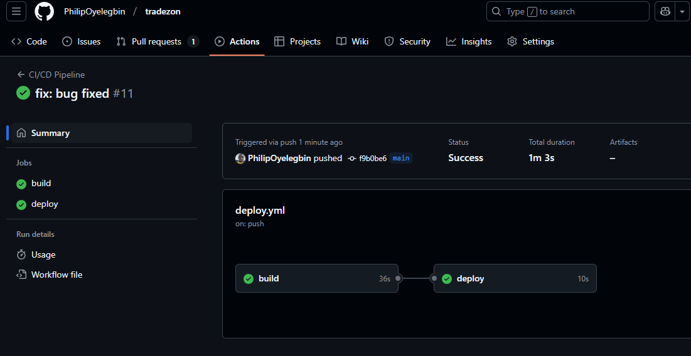

## **Module 4: CI/CD Pipeline Design**

- Learn the fundamentals of CI/CD pipelines using Jenkins, GitHub Actions, or GitLab CI.
- Hands-on Lab: Set up a simple CI/CD pipeline for a sample application.
- Project: Implement a pipeline that builds and deploys a Dockerized web app to a cloud VM.

### Steps to implement a pipeline that builds and deploys a Dockerized web app to a cloud VM.

1. Install terraform on the local linux machine.
2. Create a new directory for the project and navigate into it.
3. Initialize terraform by running the command `terraform init`.
4. Create a new file called [main.tf](./main.tf) and write infrastructure deployment code to create a new VM with docker installed.
5. Run the command `terraform fmt` to format the infrastructure code.
6. Run the command `terraform validate` to validate the infrastructure code.
7. Run the command `terraform plan` to produce the infrastructure deployment plan for review.
8. Run the command `terraform apply` to deploy the infrastructure.
9. Verify the docker is installed on the virtual machine.
   

10. Create the github action workflow file called [deploy.yml](./deploy.yml) into the [github repo](https://github.com/PhilipOyelegbin/tradezon) and push the app to github and configure GitHub Secrets.
11. Deploy and Test the Application by pushing to the main branch to trigger the pipeline
    

12. Verify that the applicaton is live on the browser.
    

13. Run the command `terraform destroy` to remove the infrastructure.

### What did I learn?

- Terraform scripting
- How to automate the deployment and installation of docker on server using Terraform.
- How to create a Dockerfile and build a docker image
- How to run and push my docker image to docker hub
- Creating a CI/CD pipeline using GitHub Actions (.yml) file
