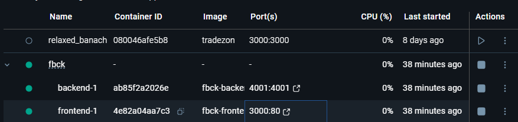
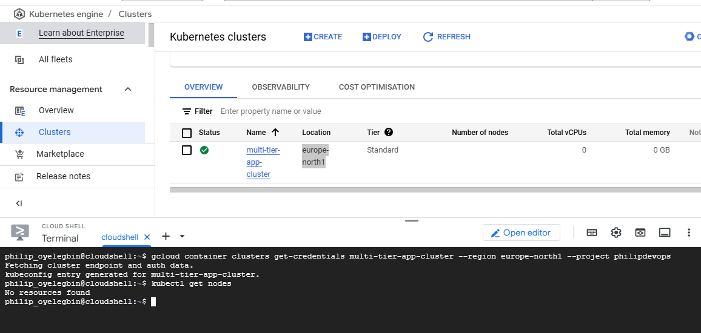

## **Module 5: Containerization & Orchestration**

- Introduction to Docker and Kubernetes.
- Hands-on Lab: Create Docker images and deploy containers.
- Project: Deploy a multi-container application using Docker Compose.

### Steps to deploy a multi-container application to GKE.

1. Created the docker file for each application in respective folders
2. Setup a mini-kublets using docker compose to test the application locally as seen below.
   

3. Install terraform on the local linux machine.
4. Create a new directory for the project and navigate into it.
5. Initialize terraform by running the command `terraform init`.
6. Create the files called [provider.tf](./provider.tf), [variable.tf](./variable.tf), [main.tf](./main.tf) and [outputs.tf](./outputs.tf) for infrastructure deployment to create a new GKE cluster.
7. Run the command `terraform fmt` to format the infrastructure code.
8. Run the command `terraform validate` to validate the infrastructure code.
9. Run the command `terraform plan` to produce the infrastructure deployment plan for review.
10. Run the command `terraform apply` to deploy the infrastructure.
11. Verify the cluster.
    

12. Create the github action workflow file called [ci-cd.yml](./ci-cd.yml) into the [github repo](https://github.com/PhilipOyelegbin/fbck) and push the app to github and configure GitHub Secrets.
13. Deploy and Test the application by using the kubernetes manifest in the ci/cd pipeline deployed to the main branch to trigger the pipeline
    

14. Verify that the applicaton is live on the browser.
    

15. Run the command `terraform destroy` to remove the infrastructure.

### What did I learn?

- Terraform scripting
- How to automate the setup of a GKE autopilot cluster using Terraform.
- How to create a Dockerfile and build a docker image.
- How to run docker compose to run the application locally.
- What a kubernetes manifest is and how to create it.
- Creating a CI/CD pipeline using GitHub Actions (.yml) file to build and deploy the docker file, also deploy the kubernetes manifest.
