## 🔧 **Web Hosting Server Setup**

**Role**: Cloud Engineer
**Task**: Set up a **web hosting server** with a **cPanel-like control panel**, enabling **multiple users** to host and manage **different websites** independently.

## 📸 Deliverables

1. I set up a virtual private server on AWS using ubuntu 24 operating system and ssh into the server, below is the snapshot of my static private IP using the command `ip a`.
   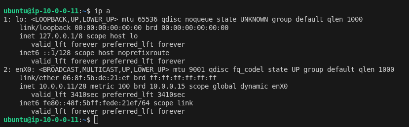

2. Installed hestiacp on the server based on my personal specification using the guide in the link (https://hestiacp.com/install). Below are the snapshot of the installation.
   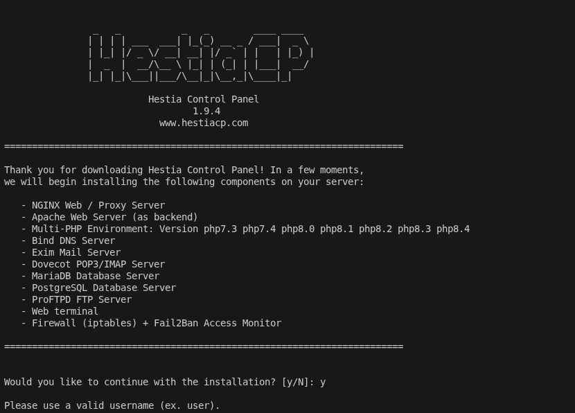
   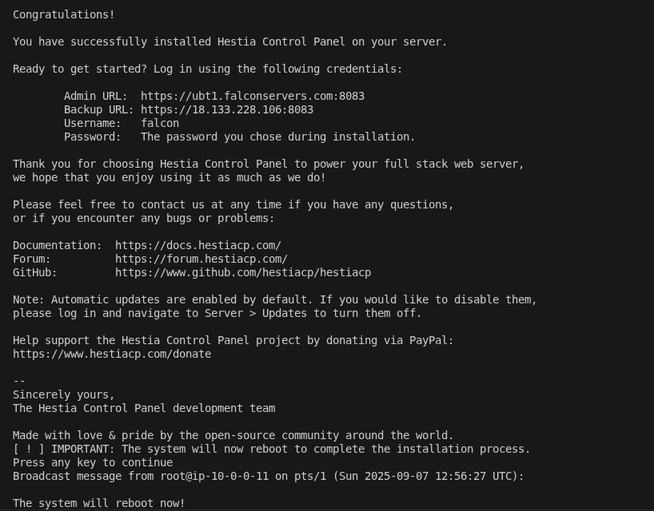

3. I was able to access the control panel login page via the broswer using the subdomain created as shown below.
   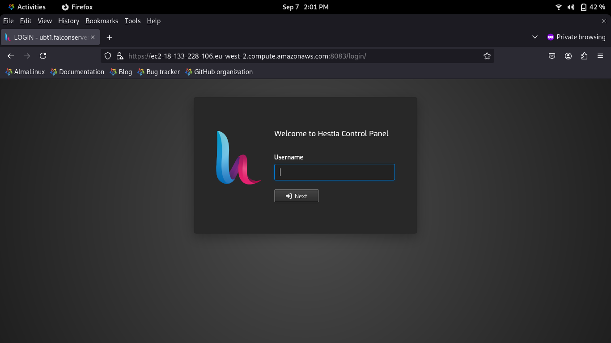

4. I was able to login as an admin via the web browser
   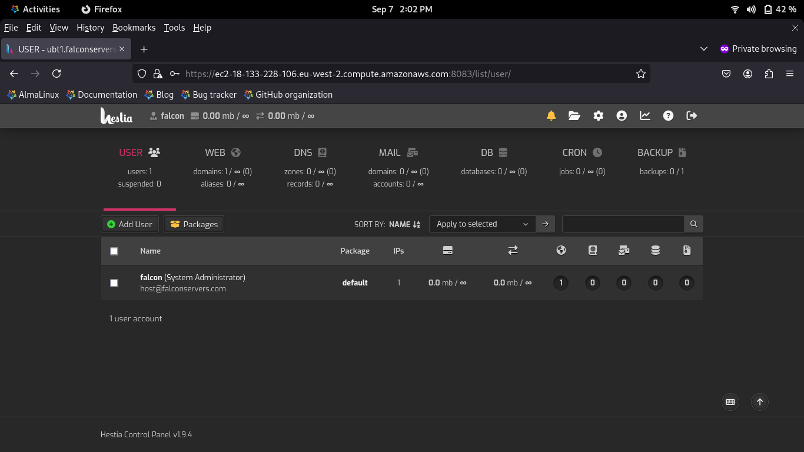

5. I created a new user account as an admin
   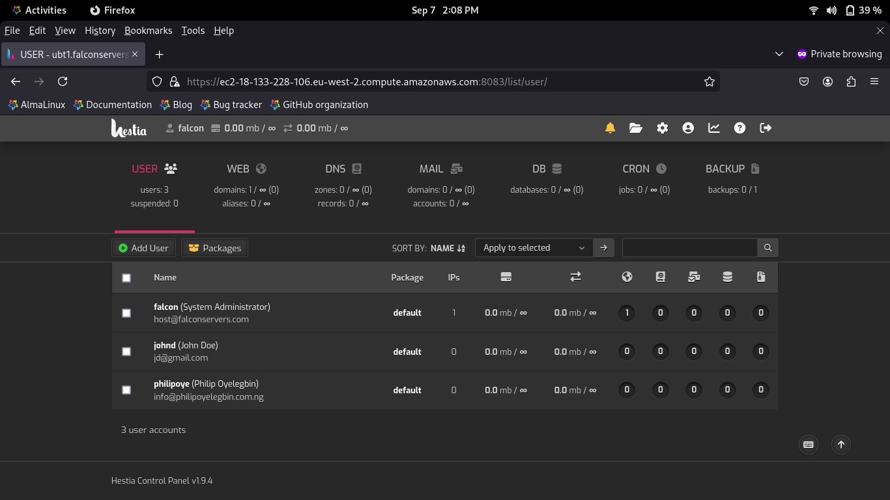

6. I logedin as a user, added a domain on the user account and setup a wordpress website using the quick install button.
   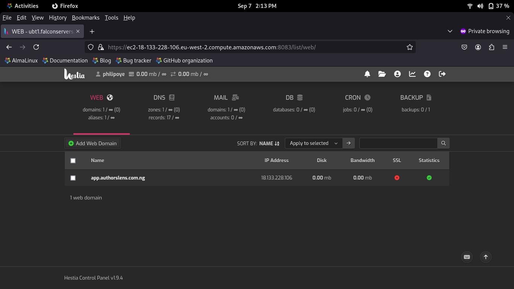
   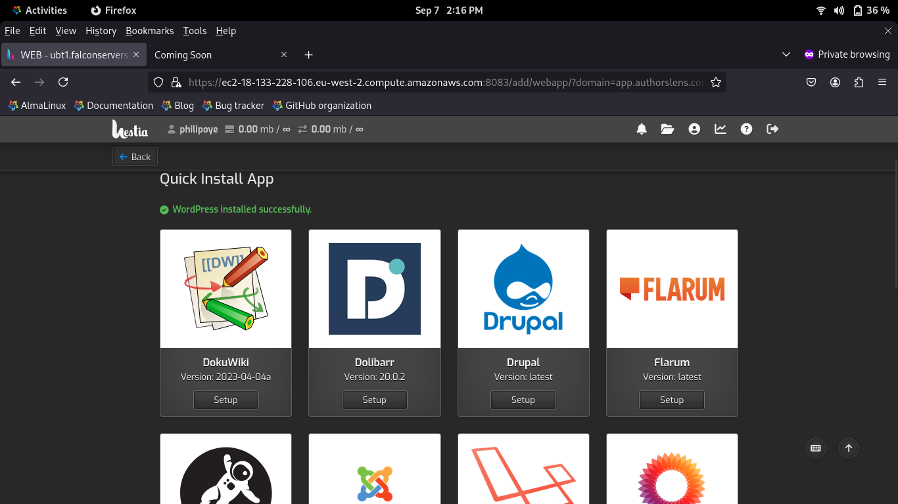
   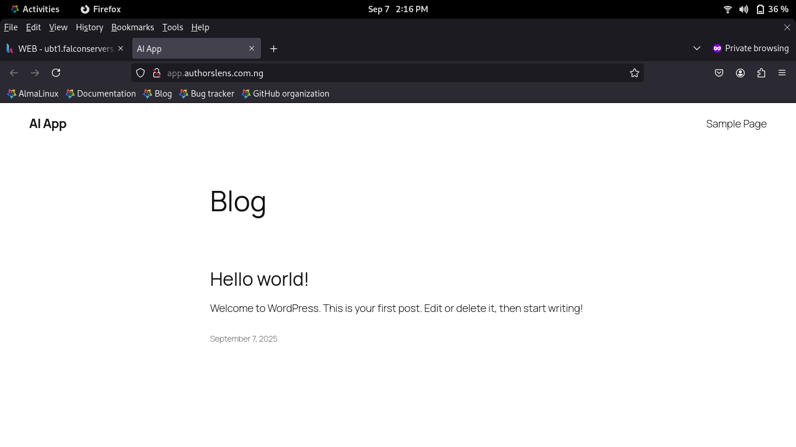

7. I was able to access the website via SSL.
   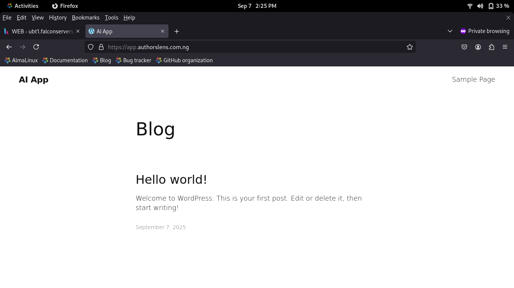

8. The domain dns can also be menagd from the cpanel as shown below
   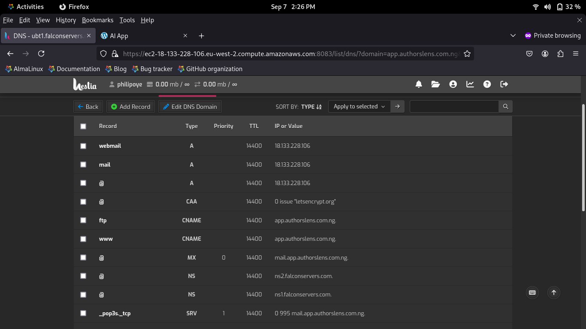

9. The firewall rule for the server can be checked by the super admin via the admin panel as shown below.
   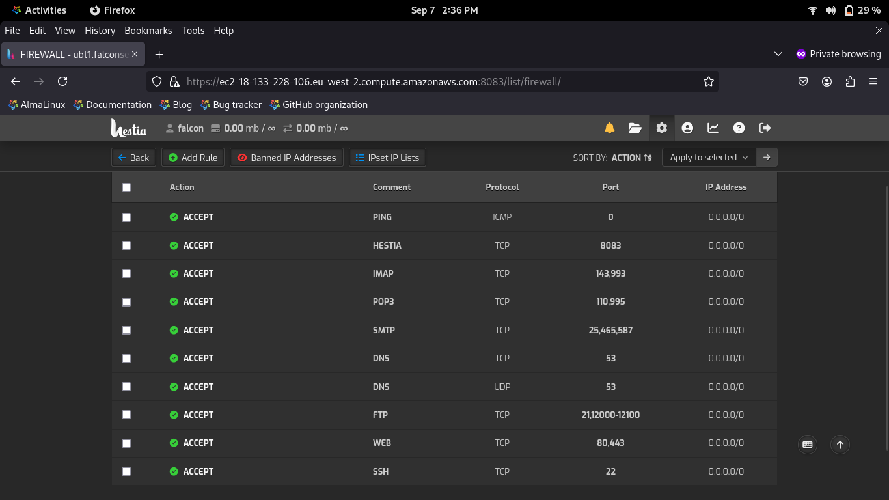

10. Resources usage, error logs, awstat can be accessed as shown below, also it can be filtered based on user if loggedin as an admin.
    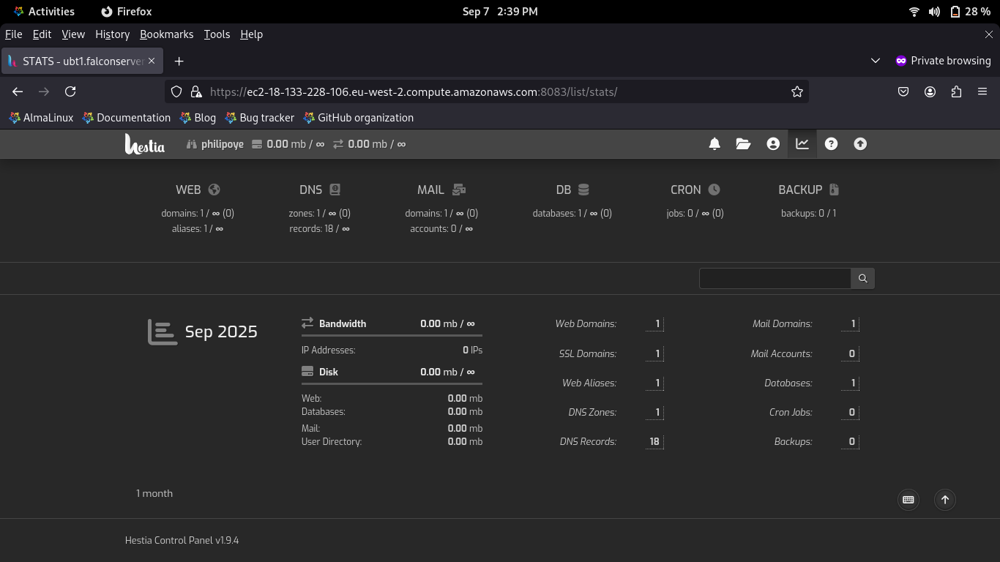
    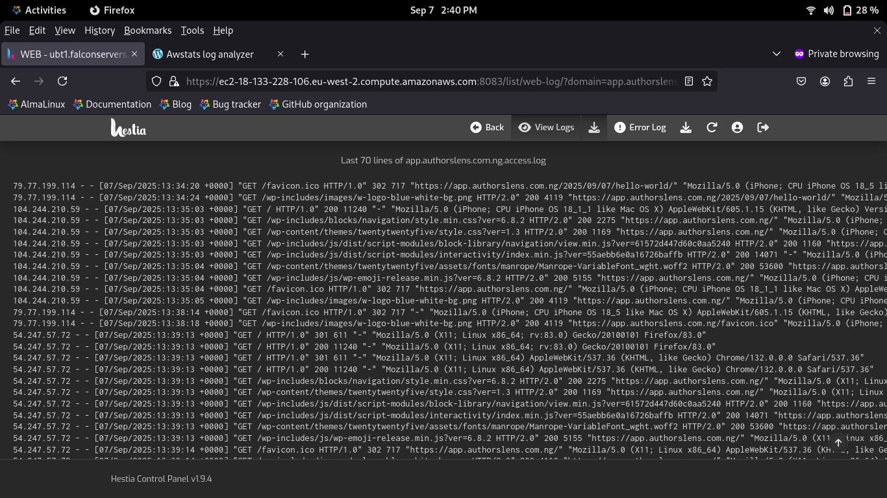
    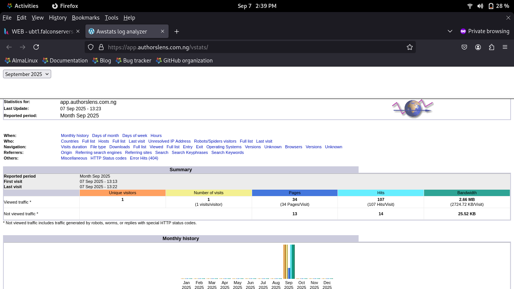
