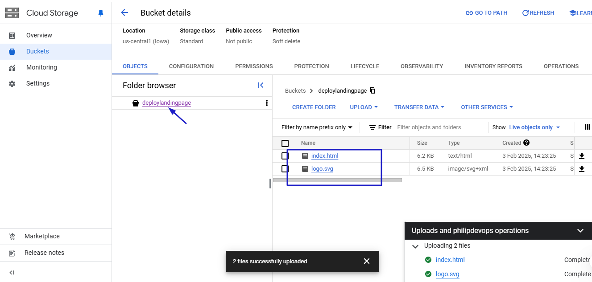
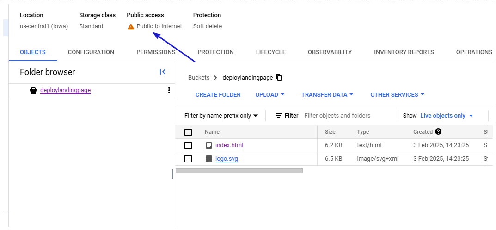
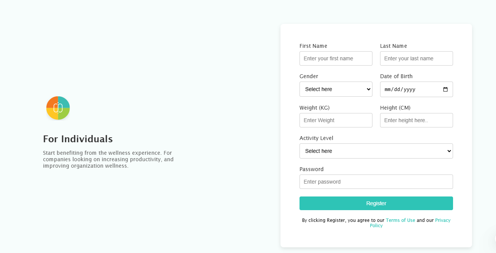

## **Module 1: Introduction to DevOps and Cloud Fundamentals**

- Overview of DevOps principles, cloud computing, and industry best practices.
- Hands-on Lab: Set up free-tier accounts on AWS/Azure/GCP.
- Project: Deploy a simple static website using an S3 bucket or cloud storage service.

### Steps taken to deploy a simple static website via the console using an Cloud Storage bucket.

1. Log into the Google cloud console and create a project
2. Click on the menu icon and navigate to Cloud storage
3. Create the "Create Bucket" button to create a new bucket
4. Input the required parameters to create your bucket
5. Upload your website files into the bucket created
   

6. Grant access to the public by updating the permissions settings of the bucket to make it publicly accessible

- remove the prevent public access and add allUser with the role of storage object viewer
  

7. Click on the index file to get the public url of the website accessible to users on browser as seen below.
   

8. Clean up the console by deleting the bucket created.

### What did I learn?

- The fundamentals of cloud computing and devops
- How to create a bucket and upload files to deploy a static website
- How to enable and disable public access to my bucket
