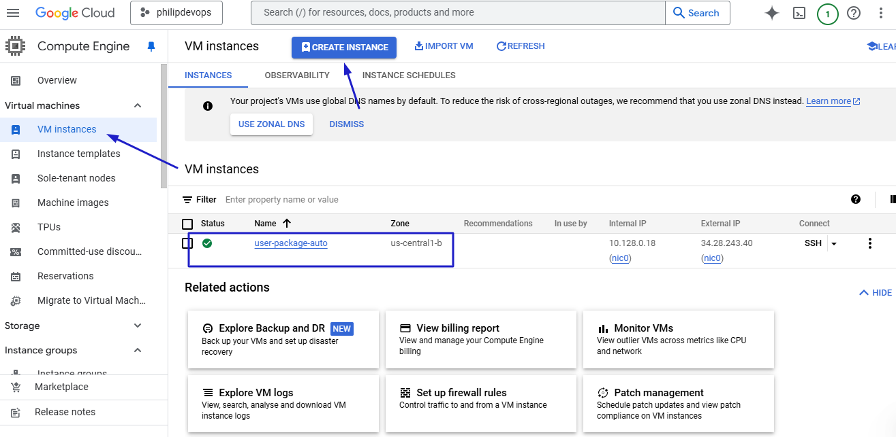
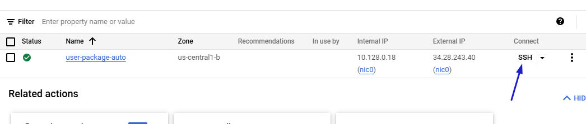
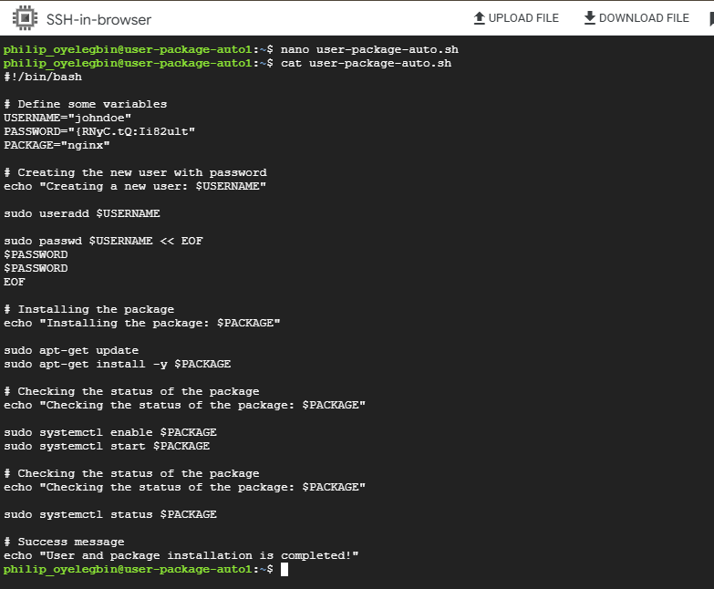
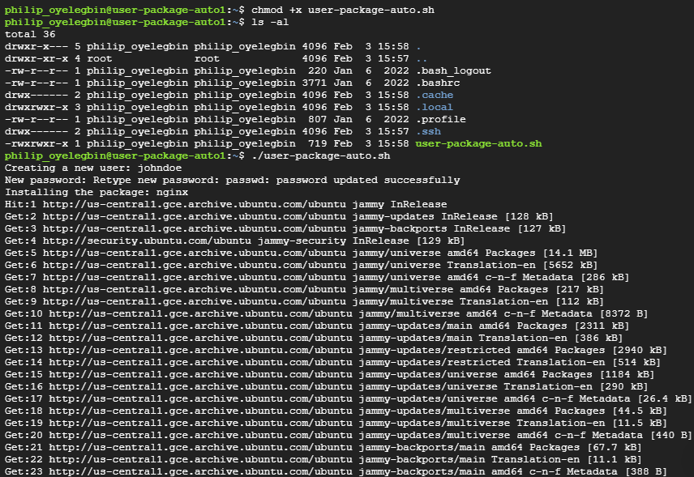
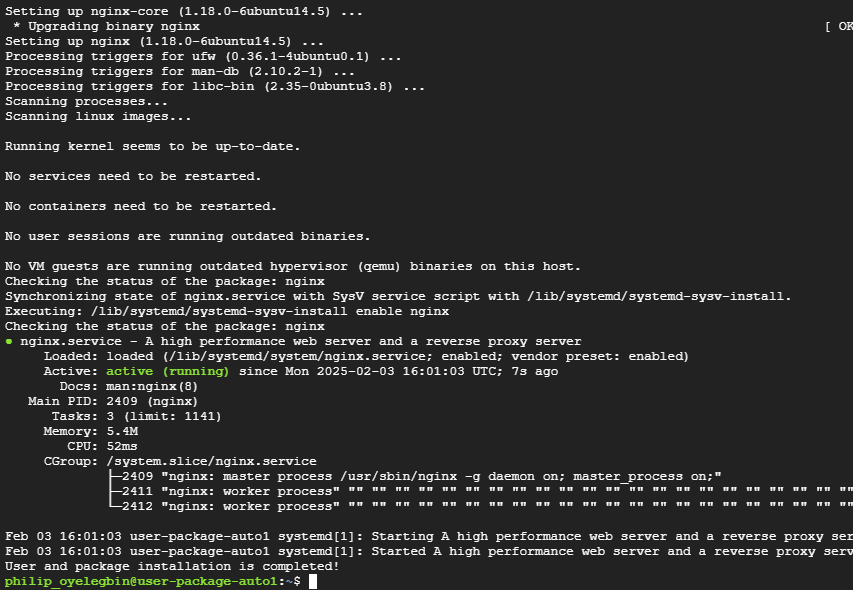

## **Module 2: Linux, Scripting, and Version Control**

- Learn Linux fundamentals and shell scripting (Bash, Python).
- Introduction to Git, GitHub, and Git workflows.
- Project: Automate user and package installation on a Linux VM with Bash scripting.

### Steps to automate user and package installation on a Linux VM with Bash scripting.

1. Login to the console and navigate to compute engine
2. Click on VM Instance and click the "CREATE INSTANCE" button to create a VM on google cloud platform running any Linux distribution (ubuntu)
   

3. Click on "SSH" to access the linux terminal of the VM
   

4. Write a bash script [automation script](./user-package-auto.sh) to automate the creation of user and package installation on the Linux VM
   

5. Make the script executable
6. Run the script on the Linux VM to automate the user creation and package installation
   
   

7. Clean up the cloud console

### What did I learn?

- Linux fundamentals and shell scripting (Bash, Python)
- Introduction to Git, GitHub, and Git workflows
- Bash scripting and execution
