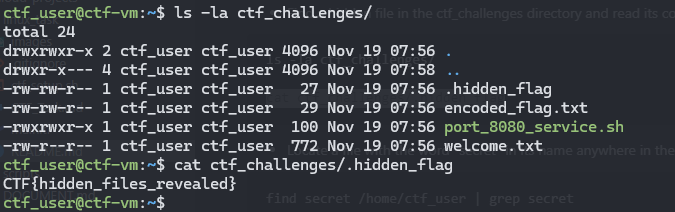
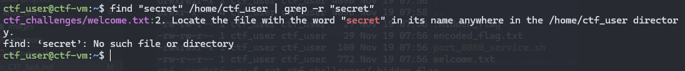
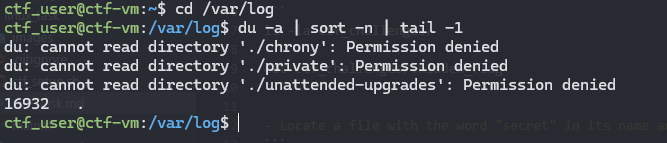
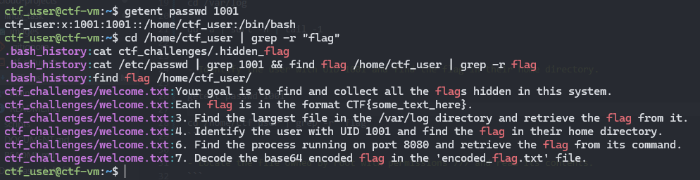
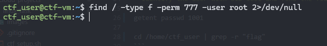
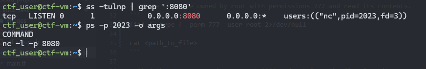
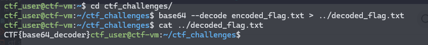

# My solution to the ltc-challenge

## Linux Command Line CTF Challenge

- Find a hidden file in the ctf_challenges directory and read its contents.
```
ls -la ctf_challenges/

cat ctf_challenges/.hidden_flag
```


- Locate a file with the word "secret" in its name anywhere in the /home/ctf_user directory.
```
find "secret" /home/ctf_user | grep -r "secret"
```


- Find the largest file in the /var/log directory and retrieve the flag from it.
```
cd /var/log

du -a | sort -n | tail -1
```


- Identify the user with UID 1001 and find the flag in their home directory.
```
getent passwd 1001

cd /home/ctf_user | grep -r "flag"
```


- Locate the file owned by root with permissions 777 and read its contents.
```
find / -type f -perm 777 -user root 2>/dev/null

cat <path_to_file>
```


- Find the process running on port 8080 and retrieve the flag from its command
```
ss -tulnp | grep ':8080'

ps -p <PID> -o args
```


- Decode the base64 encoded flag in the 'encoded_flag.txt' file.
```
base64 --decode encoded_flag.txt > decoded_flag.txt | cat decoded_flag.txt
```
